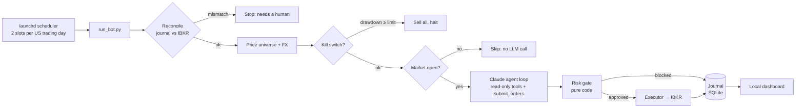
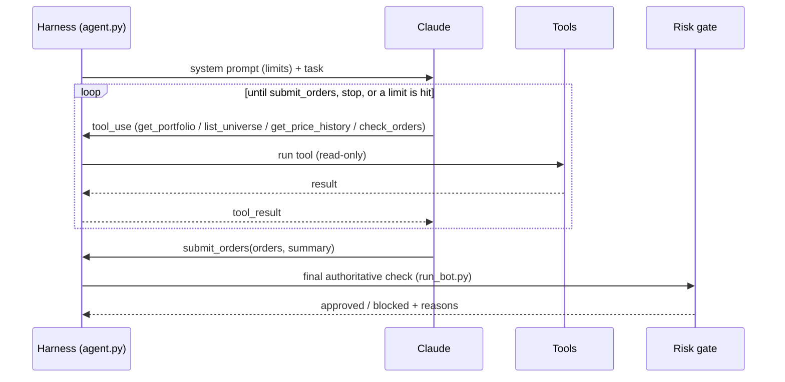

# guardrail-trader

An autonomous stock-trading agent for **Interactive Brokers (IBKR)**, built as a learning project in
**agent harness design**. Claude reviews the portfolio and proposes trades; plain, unit-tested code
decides whether any of them are allowed to reach the broker.

> **Claude proposes, code decides.** Every limit is enforced in code. Claude can read the limits,
> but it cannot change or bypass them.

⚠️ Runs against an IBKR **paper** (simulated) account by default. This is an engineering project,
not investment advice. Automated trading can lose money.

---

## How it works



---

## The rules (risk gate)

Every order Claude proposes goes through the gate **twice**: once when Claude calls `check_orders` or
`submit_orders`, so it can see why an order was blocked, and again, authoritatively, in [`run_bot.py`](scripts/run_bot.py)
before anything is sent. Orders are evaluated on a *simulated* portfolio in sequence, sells first,
so several orders together can't break a limit that each one passes on its own.

| Rule | Value | Where it's enforced |
|---|---|---|
| Only allowlisted instruments (50 tickers) | [`config/universe/*.csv`](config/universe/) | [`risk/gate.py`](guardrail_trader/risk/gate.py) → `_check()`; list loaded by [`risk/config.py`](guardrail_trader/risk/config.py) → `load_risk_config()` |
| Max single holding | 25% of portfolio | [`risk/gate.py`](guardrail_trader/risk/gate.py) → `_check()` (BUY branch) · [`config/risk.toml`](config/risk.toml) `max_position_pct` |
| Max orders per calendar month (Sydney) | 10 | [`risk/gate.py`](guardrail_trader/risk/gate.py) → `_check()` · count from [`journal.py`](guardrail_trader/journal.py) → `orders_this_month()` |
| Kill switch: drawdown from peak | 25% → sell all, halt | [`risk/gate.py`](guardrail_trader/risk/gate.py) → `kill_switch_triggered()`, `liquidation_proposals()` · [`run_bot.py`](scripts/run_bot.py) step 3 |
| Halt persists until manually reset | — | [`journal.py`](guardrail_trader/journal.py) → `halt()` / `reset_halt()` · [`scripts/journal_cli.py reset-halt --confirm`](scripts/journal_cli.py) |
| No shorting: sell only what is held | hard-coded | [`risk/gate.py`](guardrail_trader/risk/gate.py) → `_check()` (SELL branch) |
| No margin: cost plus commission ≤ cash | hard-coded | [`risk/gate.py`](guardrail_trader/risk/gate.py) → `_check()` (BUY branch) |
| Limit orders only, within ±2% of reference price | `max_price_deviation_pct` | [`risk/gate.py`](guardrail_trader/risk/gate.py) → `_check()` |
| Commission ≤ 10% of order value | `max_commission_pct` | [`risk/gate.py`](guardrail_trader/risk/gate.py) → `_check()` · estimate from IBKR what-if [`broker/ibkr.py`](guardrail_trader/broker/ibkr.py) → `preview_order()` |
| Whole shares only (IBKR API rejects fractional orders) | `allow_fractional = false` | [`risk/gate.py`](guardrail_trader/risk/gate.py) → `_check()` |
| Invalid config refuses to load (fail-closed) | — | [`risk/config.py`](guardrail_trader/risk/config.py) → `load_risk_config()`, `_pct()` |

All tunable values live in [`config/risk.toml`](config/risk.toml). Every rule has tests in
[`tests/test_risk_gate.py`](tests/test_risk_gate.py).

---

## The harness (everything around Claude)

| Concern | What the harness does | Where |
|---|---|---|
| **Tools** | Claude gets read-only tools (`get_portfolio`, `list_universe`, `get_price_history`, `check_orders`) plus one final action (`submit_orders`). It never talks to the broker. | [`agent.py`](guardrail_trader/agent.py) → `TOOLS`, `_dispatch()` |
| **Permissions** | The gate decides; the executor only places orders the gate approved. | [`run_bot.py`](scripts/run_bot.py) step 5 · [`executor.py`](guardrail_trader/executor.py) → `execute()` |
| **Paper vs live safety** | Paper mode refuses IBKR's live ports; the account ID must match the mode (paper IDs start with `DU`); read-only connections can't place orders. | [`broker/ibkr.py`](guardrail_trader/broker/ibkr.py) → `check_endpoint()`, `check_account()`, `place_order()` |
| **Reconciliation** | Before each run, the journal's holdings must equal IBKR's positions, with no stray open orders; otherwise it stops. | [`run_bot.py`](scripts/run_bot.py) step 1 |
| **Virtual budget** | The paper account holds far more than the budget; the bot only sees its own ledger's cash. | [`journal.py`](guardrail_trader/journal.py) → `init_budget()`, `cash_base()`, `portfolio_state()` |
| **Fill accounting** | Only real fills are booked (partial fills handled; unfilled orders cancelled). | [`executor.py`](guardrail_trader/executor.py) → `execute()` · [`broker/ibkr.py`](guardrail_trader/broker/ibkr.py) → `fill_details()` |
| **Market-hours check** | Uses IBKR's own trading hours (holidays included); won't trade with less than 15 minutes to the close. | [`market.py`](guardrail_trader/market.py) → `market_sessions()`, `is_open()` |
| **Tool-error handling** | Tool errors go back to Claude as `is_error` results instead of crashing the loop. | [`agent.py`](guardrail_trader/agent.py) → `_dispatch()` |
| **Observability** | Every proposal, Claude's reason, the gate verdict, orders, fills and LLM cost are recorded. Full transcripts are saved per run. | [`journal.py`](guardrail_trader/journal.py) · `data/runs/run_<id>.json` · [Dashboard](#dashboard) |
| **Scheduling** | Runs at New York-time slots (handles both US and Sydney daylight saving), at most 3 attempts per slot, file lock against overlapping runs. | [`scripts/scheduled_run.py`](scripts/scheduled_run.py) → `SLOTS`, `MAX_ATTEMPTS`, `current_slot()` |

---

## The agent loop



The loop is in [`agent.py`](guardrail_trader/agent.py) → `TradingAgent.run()`. It stops when:

- Claude calls `submit_orders` (an empty list means "hold"),
- Claude ends its turn without submitting, which means **no trades**,
- `MAX_TURNS` is reached (20, env `AGENT_MAX_TURNS`), or
- the per-run cost budget is exceeded (see below).

Per-run tool limits: `MAX_HISTORY_CALLS = 15` (IBKR pacing and cost) and `MAX_CHECK_CALLS = 5`,
both in [`agent.py`](guardrail_trader/agent.py).

---

## Budget constraints

| Constraint | Value | Where |
|---|---|---|
| Virtual trading capital | A$5,000 during the paper phase | [`config/risk.toml`](config/risk.toml) `[budget]` · [`journal.py`](guardrail_trader/journal.py) → `init_budget()` |
| LLM cost per run | stop at **US$0.10**, no trades | `.env` `LLM_RUN_BUDGET_USD` · [`agent.py`](guardrail_trader/agent.py) → `TradingAgent.run()` |
| LLM cost per month | skip runs once **US$2.50** is spent | `.env` `LLM_MONTHLY_BUDGET_USD` · [`run_bot.py`](scripts/run_bot.py) step 4 · [`journal.py`](guardrail_trader/journal.py) → `llm_spend_usd()` |
| Cost measured from real usage | tokens × published prices (incl. cache and web search) | [`llm.py`](guardrail_trader/llm.py) → `PRICES`, `cost_usd()` · table `llm_usage` |
| Unpriced models refused | a model with no known price can't be used | [`llm.py`](guardrail_trader/llm.py) → `model()` |
| Prompt caching | system prompt, tools and conversation prefix cached | [`agent.py`](guardrail_trader/agent.py) → `run()`, `_move_cache_breakpoint()` |
| No LLM call when the market is closed | weekends, holidays, outside slots | [`run_bot.py`](scripts/run_bot.py) (before step 4) · [`scripts/scheduled_run.py`](scripts/scheduled_run.py) |
| Small universe | 50 tickers keeps prompts small and pricing fast | [`config/risk.toml`](config/risk.toml) `[universe]` · [`scripts/refresh_universe.py`](scripts/refresh_universe.py) |
| Web search off by default | each search costs extra | `.env` `ENABLE_WEB_SEARCH` · [`agent.py`](guardrail_trader/agent.py) → `WEB_SEARCH_TOOL` |
| Provider choice | Anthropic direct or OpenRouter (same Messages API) | [`llm.py`](guardrail_trader/llm.py) → `make_client()` |

---

## Quick start (macOS, paper account)

Prerequisites: Python 3.11+, an IBKR account with a paper (or free-trial) login, and
[IB Gateway](https://www.interactivebrokers.com.au/en/trading/ibgateway-stable.php) logged in to
**Paper**, with the API enabled on port **4002** and localhost only.

```bash
python3 -m venv .venv
.venv/bin/pip install -e ".[dev]" pandas lxml openpyxl requests
cp .env.example .env                                   # add ANTHROPIC_API_KEY (or OpenRouter)

.venv/bin/python scripts/check_connection.py           # read-only IBKR check
.venv/bin/python scripts/journal_cli.py init           # deposit the virtual budget (once)
.venv/bin/python scripts/run_bot.py --dry-run --fake-claude   # whole harness, no API cost, no orders
.venv/bin/python scripts/run_bot.py --dry-run          # real Claude, nothing sent to IBKR
.venv/bin/python scripts/run_bot.py                    # paper trading (market must be open)
```

### Run unattended

```bash
scripts/launchd.sh install    # scheduler (every 15 min), keep-awake, dashboard
scripts/launchd.sh status
scripts/launchd.sh uninstall
```

### Run in Docker (alternative to launchd)

Three services in [`docker-compose.yml`](docker-compose.yml), one image built from the [`Dockerfile`](Dockerfile):

| Service | What it runs |
|---|---|
| `ib-gateway` | [gnzsnz/ib-gateway](https://github.com/gnzsnz/ib-gateway-docker): IB Gateway + IBC (auto-login, daily restart). Paper login verified with no 2FA prompt. |
| `bot` | [supercronic](https://github.com/aptible/supercronic) runs [`scripts/scheduled_run.py`](scripts/scheduled_run.py) every 15 min ([`docker/crontab`](docker/crontab)), connecting to `ib-gateway:4004` |
| `dashboard` | the dashboard, published on `127.0.0.1:8765` only; no API key in this container |

```bash
cp .env.example .env                                  # bot settings + ANTHROPIC_API_KEY
cp docker/gateway.env.example docker/gateway.env      # TWS_USERID=<paper username>
printf '%s' 'your-password' > docker/secrets/tws_password.txt && chmod 600 docker/secrets/*
scripts/launchd.sh docker-mode                        # stop native scheduler + dashboard, keep keep-awake
# quit the native IB Gateway app (IBKR allows one session per username)
docker compose build && docker compose up -d
```

Rollback to native: `docker compose down`, reopen and log in to IB Gateway, then `scripts/launchd.sh install`.

- IB Gateway only accepts localhost connections. Inside the image, socat forwards `0.0.0.0:4004` to `127.0.0.1:4002`, and the port check treats 4004/4003 as paper/live ([`config.py`](guardrail_trader/config.py)).
- IBKR allows **one session per username**: stop the native IB Gateway before starting the `ib-gateway` container.
- `data/`, `logs/` and `config/` are bind-mounted from the project folder, so the journal and `journal_cli.py` work the same as the native setup.
- The Mac must still be awake. The containers run in Docker Desktop's VM, which pauses when the Mac sleeps.

### See what it did

```bash
.venv/bin/python scripts/dashboard.py        # http://127.0.0.1:8765 — see "Dashboard" below
.venv/bin/python scripts/journal_cli.py status   # same data in the terminal
```

---

## Dashboard

A local web page that shows everything the bot has done. It is **read-only**: it reads the
journal and scheduler files, and never connects to IBKR or places orders. It listens on
`127.0.0.1` only.

```bash
.venv/bin/python scripts/dashboard.py              # opens http://127.0.0.1:8765
.venv/bin/python scripts/dashboard.py --port 9000 --no-browser
```

When the LaunchAgents are installed ([`scripts/launchd.sh install`](scripts/launchd.sh)), the dashboard runs all the
time as `com.guardrail-trader.dashboard` and restarts if it crashes. The page refreshes every
60 seconds and has a light/dark toggle.

| Section | What it shows |
|---|---|
| **Summary tiles** | Portfolio value, profit/loss vs starting capital, cash, drawdown (meter towards the kill switch), orders this month vs limit, LLM spend vs monthly cap, last run, **scheduler health** (running or silent, plus the next slot in Sydney time) |
| **Kill-switch banner** | Red banner, with the reset command, when trading is halted |
| **Portfolio value chart** | Value at the end of each run against a dashed starting-capital line; hover for run details |
| **Holdings** | Quantity, average cost (incl. commission), latest price, value, profit/loss, weight |
| **Decisions** | Every order Claude proposed: the gate verdict and block reasons, what IBKR did with it (filled / partial / not filled / dry run), and Claude's reason. Filters: all · approved · blocked · hide dry/fake runs |
| **Runs** | Mode, status, value, approved/blocked counts, LLM cost. **Click a run to open Claude's step-by-step transcript**: every tool call and result |
| **Fills** | What actually executed at IBKR and was booked in the ledger |
| **LLM spend** | Cost, runs and tokens per month |

**Where it's implemented**

| Piece | File |
|---|---|
| HTTP server (Python standard library only; `/`, `/api/data`, `/api/transcript/<run_id>`) | [`scripts/dashboard.py`](scripts/dashboard.py) |
| Data layer: journal queries, average cost, scheduler status, transcript simplifier | [`guardrail_trader/dashboard_data.py`](guardrail_trader/dashboard_data.py) → `build()`, `transcript()`, `_scheduler_status()` |
| Page (HTML/CSS/JS, inline SVG chart, no external dependencies) | [`guardrail_trader/web/dashboard.html`](guardrail_trader/web/dashboard.html) |
| Holdings prices per run (so the dashboard needs no broker) | [`journal.py`](guardrail_trader/journal.py) → `finish_run()` writes the `snapshots` table |
| Scheduler heartbeat and slot history | `data/scheduler_heartbeat.json`, `data/scheduler_state.json` (written by [`scripts/scheduled_run.py`](scripts/scheduled_run.py)) |
| Tests | [`tests/test_dashboard.py`](tests/test_dashboard.py) |

---

## Configuration

| File | Purpose |
|---|---|
| `.env` (never committed) | API keys, LLM provider/model, spend caps, IBKR host/port/mode |
| [`config/risk.toml`](config/risk.toml) | Budget, risk limits, universe files |
| [`config/universe/saif_picks.csv`](config/universe/saif_picks.csv) | Owner-picked tickers |
| [`config/universe/top_sp500.csv`](config/universe/top_sp500.csv) | Largest S&P 500 names by SPY weight, which top the universe up to 50; refresh monthly with [`scripts/refresh_universe.py`](scripts/refresh_universe.py) |

---

## Project layout

| Path | Purpose |
|---|---|
| [`guardrail_trader/broker/ibkr.py`](guardrail_trader/broker/ibkr.py) | IBKR adapter: executes, never decides; paper/live safety checks |
| [`guardrail_trader/risk/gate.py`](guardrail_trader/risk/gate.py) | The risk gate (pure functions) |
| [`guardrail_trader/risk/config.py`](guardrail_trader/risk/config.py) | Loads and validates `risk.toml` and the universe |
| [`guardrail_trader/agent.py`](guardrail_trader/agent.py) | Claude agent loop, tools, caching, per-run cost stop |
| [`guardrail_trader/llm.py`](guardrail_trader/llm.py) | Provider switch, prices, cost accounting, caps |
| [`guardrail_trader/journal.py`](guardrail_trader/journal.py) | SQLite: ledger, runs, proposals, orders, snapshots, LLM usage |
| [`guardrail_trader/executor.py`](guardrail_trader/executor.py) | Places approved orders, books fills |
| [`guardrail_trader/market.py`](guardrail_trader/market.py) | Prices, history summaries, market hours |
| [`guardrail_trader/dashboard_data.py`](guardrail_trader/dashboard_data.py) | Read-only views for the dashboard |
| [`guardrail_trader/web/dashboard.html`](guardrail_trader/web/dashboard.html) | Dashboard UI |
| [`guardrail_trader/fake_llm.py`](guardrail_trader/fake_llm.py) | Scripted stand-in for Claude (tests, `--fake-claude`) |
| [`scripts/run_bot.py`](scripts/run_bot.py) | One bot run: reconcile → price → kill switch → Claude → gate → execute |
| [`scripts/scheduled_run.py`](scripts/scheduled_run.py) | Unattended entry point called by launchd |
| [`scripts/launchd.sh`](scripts/launchd.sh) | Install / uninstall / status of the LaunchAgents |
| [`scripts/dashboard.py`](scripts/dashboard.py) | Dashboard server |
| [`scripts/journal_cli.py`](scripts/journal_cli.py) | Operator CLI: `init`, `status`, `reset-halt` |
| [`scripts/check_connection.py`](scripts/check_connection.py) | IBKR connection smoke test (read-only; `--test-order` on paper) |
| [`scripts/refresh_universe.py`](scripts/refresh_universe.py) | Rebuilds the top-S&P 500 part of the universe |
| [`scripts/affordability.py`](scripts/affordability.py) | Which allowlisted tickers fit the position limit |
| [`config/`](config/) | `risk.toml` and universe CSVs |
| [`tests/`](tests/) | Gate, broker safety, journal, agent, LLM budget, dashboard |

---

## Tests

```bash
.venv/bin/python -m pytest -q
```

The tests run without a broker or API key. A scripted stand-in for Claude
([`guardrail_trader/fake_llm.py`](guardrail_trader/fake_llm.py)) exercises the full tool protocol.

---

## Known limitations

- **IB Gateway login:** IBKR requires a fresh login weekly, and IB Gateway doesn't restart itself after a reboot. [IBC](https://github.com/IbcAlpha/IBC) can automate this; it isn't set up yet.
- **Local hosting:** the Mac must stay awake with the lid open. The keep-awake job prevents idle sleep only.
- **Whole shares only:** the IBKR API rejects fractional-share orders.
- **Delayed prices:** the free-trial paper account gets delayed (~15 min) market data.
- **Not built yet:** planned AWS hosting (EventBridge Scheduler → Step Functions → ECS Fargate task, journal on S3).
