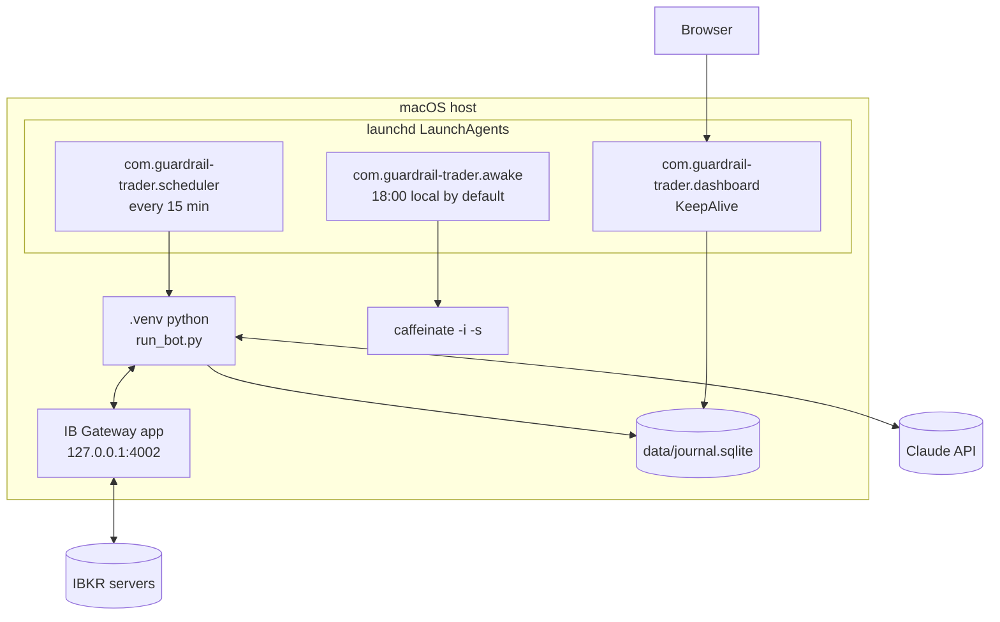
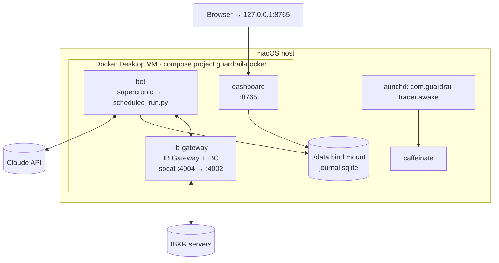

# Architecture

The same Python package runs in both modes. Only the **host** of each component changes.

## Components

| Component | Role | Code |
|---|---|---|
| IB Gateway | IBKR's API endpoint. The bot talks to it over the TWS socket API (`ib_async`). | external |
| Scheduler | Every 15 minutes: "is it a trading slot, and has this slot already run?" | [`scripts/scheduled_run.py`](https://github.com/saifulislamamiyo/guardrail-trader/blob/main/scripts/scheduled_run.py) |
| Trader run | Reconcile → price → kill switch → Claude → gate → execute | [`guardrail_trader/pipeline.py`](https://github.com/saifulislamamiyo/guardrail-trader/blob/main/guardrail_trader/pipeline.py) → `run_once()`, CLI [`scripts/run_bot.py`](https://github.com/saifulislamamiyo/guardrail-trader/blob/main/scripts/run_bot.py) |
| Agent | The Claude loop and its tools | [`guardrail_trader/agent.py`](https://github.com/saifulislamamiyo/guardrail-trader/blob/main/guardrail_trader/agent.py) |
| Risk gate | Pure functions that approve or block each proposal | [`guardrail_trader/risk/gate.py`](https://github.com/saifulislamamiyo/guardrail-trader/blob/main/guardrail_trader/risk/gate.py) |
| Journal | SQLite: ledger, runs, proposals, orders, snapshots, LLM usage | [`guardrail_trader/journal.py`](https://github.com/saifulislamamiyo/guardrail-trader/blob/main/guardrail_trader/journal.py) |
| Dashboard | Read-only web page over the journal | [`scripts/dashboard.py`](https://github.com/saifulislamamiyo/guardrail-trader/blob/main/scripts/dashboard.py) |
| Keep-awake | Stops the Mac idle-sleeping on trading nights | [`scripts/keep_awake.py`](https://github.com/saifulislamamiyo/guardrail-trader/blob/main/scripts/keep_awake.py) |

## Native mode

| What | Runs as |
|---|---|
| IB Gateway | Desktop app; you log in (paper) and it keeps a session. |
| Scheduler + trader | `.venv/bin/python scripts/scheduled_run.py`, started by launchd every 900 s |
| Dashboard | `.venv/bin/python scripts/dashboard.py --no-browser`, restarted by launchd if it exits |
| Keep-awake | `.venv/bin/python scripts/keep_awake.py` → `caffeinate` until 16:00 New York |
| Journal | `data/journal.sqlite` file |

## Docker mode

| Service | What it runs | Ports (host, localhost only) |
|---|---|---|
| `ib-gateway` | [gnzsnz/ib-gateway](https://github.com/gnzsnz/ib-gateway-docker) image: IB Gateway + [IBC](https://github.com/IbcAlpha/IBC) auto-login, daily restart | 14002 (API, diagnostics), 15900 (VNC) |
| `bot` | [supercronic](https://github.com/aptible/supercronic) runs `scheduled_run.py` every 15 min ([`docker/crontab`](https://github.com/saifulislamamiyo/guardrail-trader/blob/main/docker/crontab)); healthcheck on the scheduler heartbeat | none |
| `dashboard` | `dashboard.py` bound to `0.0.0.0` inside the container; no API key in its environment | 8765 |

Networks are split so that **only the bot can reach the IB Gateway API**, which has no
authentication of its own:

| Network | Members | Purpose |
|---|---|---|
| `broker` (internal, no route out) | `ib-gateway`, `bot` | the IB API on port 4004 |
| `gateway_egress` | `ib-gateway` | IBKR servers, localhost-only host ports |
| `bot_egress` | `bot` | Claude API |
| `web` | `dashboard` | `127.0.0.1:8765` on the host |

`data/`, `logs/` and `config/` (read-only) are bind-mounted from the project folder, so the journal
is the same file in both modes.

!!! note "Why the port is 4004, not 4002"
    IB Gateway only accepts API connections from localhost. Inside the image, socat forwards
    `0.0.0.0:4004` to `127.0.0.1:4002`, so the bot container can connect while the gateway still
    sees localhost. The bot's paper/live port check treats 4004 as paper and 4003 as live
    ([`config.py`](https://github.com/saifulislamamiyo/guardrail-trader/blob/main/guardrail_trader/config.py)).

## Data flow of one run

1. **Broker ready?** the gateway must actually serve account data (a connected socket isn't enough).
2. **Reconcile:** journal holdings must equal IBKR positions, with no stray open orders.
3. **Price:** the whole universe plus FX to the base currency.
4. **Kill switch:** if drawdown from peak ≥ the limit, sell everything and halt.
5. **Claude:** the agent loop, only if the market is open and the monthly LLM cap has room.
6. **Gate:** final, authoritative check of every proposal.
7. **Execute:** place approved limit orders, wait for fills, cancel leftovers, book fills.

Every step writes to the journal, which the dashboard reads.
