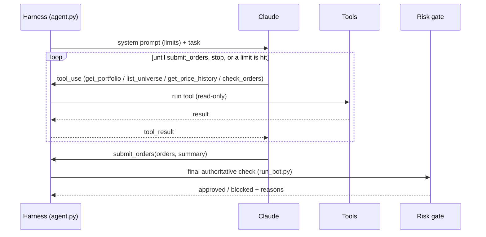

# Harness and agent loop

## Two ideas

- **Agent loop:** call the model → if it asks for a tool, run the tool → send the result back →
  repeat until it stops asking or a limit is hit. The API is stateless, so the growing message
  list *is* the agent's memory.
- **Harness:** everything around that loop: which tools exist, what they're allowed to do, when the
  loop must stop, what it may spend, and what gets recorded. In this project the harness, not the
  prompt, is what makes an LLM safe to let near a brokerage account.

## The loop in this project

Implemented in [`agent.py`](https://github.com/saifulislamamiyo/guardrail-trader/blob/main/guardrail_trader/agent.py) → `TradingAgent.run()`. The loop stops when:

- Claude calls `submit_orders` (an empty list means "hold"),
- Claude ends its turn without submitting, which means **no trades**,
- `MAX_TURNS` (20) is reached,
- the per-run cost budget is exceeded, or
- the loop runs longer than `AGENT_MAX_SECONDS` (300 s). Each API call also has a timeout
  (`LLM_REQUEST_TIMEOUT_S`, 60 s, capped by the time left) and at most 2 retries.

Every one of these ends the run with **no trades**.

## Tools Claude gets

| Tool | Kind | Limit per run |
|---|---|---|
| `get_portfolio` | read | — |
| `list_universe` | read | — |
| `get_price_history` | read | `MAX_HISTORY_CALLS = 15` |
| `check_orders` | dry-run the gate | `MAX_CHECK_CALLS = 5` |
| `submit_orders` | final answer (a proposal, not an order) | ends the loop; bounced **once** if an order breaks a limit |

Claude never talks to the broker. `submit_orders` only hands proposals back to the harness.

For what Claude looks at when picking stocks, and how an ML model could plug in, see
[How stocks are chosen](stock-selection.md).

## Feedback inside the loop and across runs

- **Same run:** `check_orders` dry-runs proposals through the real gate. If `submit_orders` still
  contains a blocked order, the harness returns the gate's reasons as a tool error and lets Claude
  revise **once** (`MAX_SUBMIT_REVISIONS = 1`). After that, blocked orders are dropped and the rest
  go ahead. The bound stops a model from negotiating with the gate indefinitely.
- **Across runs:** `get_portfolio` includes `recent_activity`, the last 10 real orders and what
  happened to each (blocked with reasons, filled, partially filled, not filled). Unfilled orders
  still count toward the monthly limit, so Claude is told not to repeat them blindly.
  Source: [`journal.py`](https://github.com/saifulislamamiyo/guardrail-trader/blob/main/guardrail_trader/journal.py) → `recent_activity()`.

## Orders and fills

Orders are DAY limit orders. After placing them, the executor waits up to 120 s, cancels anything
still working, and books only real fills:

- **Fill/cancel race:** an order can fill between the status check and the cancel. `cancel_order()`
  then returns the final state instead of raising.
- **Settled fills:** executions and commission reports arrive separately. `fill_details()` waits
  until the executions add up to the filled quantity and each has its commission.
- **Still working after cancel:** the known fills are booked and a warning logged. If more fill later,
  the next run's reconciliation stops trading until a human looks.

## Harness concerns and where they live

| Concern | What the harness does | Where |
|---|---|---|
| Permissions | The gate decides; the executor only places gate-approved orders. | [`run_bot.py`](https://github.com/saifulislamamiyo/guardrail-trader/blob/main/scripts/run_bot.py) step 5 · [`executor.py`](https://github.com/saifulislamamiyo/guardrail-trader/blob/main/guardrail_trader/executor.py) |
| Paper vs live safety | Refuses live ports in paper mode; account ID must match the mode. | [`broker/ibkr.py`](https://github.com/saifulislamamiyo/guardrail-trader/blob/main/guardrail_trader/broker/ibkr.py) → `check_endpoint()`, `check_account()` |
| Reconciliation | Journal holdings must equal IBKR positions before any run. | `run_bot.py` step 1 |
| Virtual budget | The bot only sees its own ledger's cash, not the whole paper account. | [`journal.py`](https://github.com/saifulislamamiyo/guardrail-trader/blob/main/guardrail_trader/journal.py) → `cash_base()` |
| Stop conditions | Max turns, per-run cost, per-tool call limits. | `agent.py` |
| Spend control | Cost from real token usage; monthly cap checked before calling Claude. | [`llm.py`](https://github.com/saifulislamamiyo/guardrail-trader/blob/main/guardrail_trader/llm.py) → `cost_usd()` |
| Context management | Prompt caching; price history summarised before it reaches Claude. | `agent.py` → `_move_cache_breakpoint()` · [`market.py`](https://github.com/saifulislamamiyo/guardrail-trader/blob/main/guardrail_trader/market.py) → `summarize_history()` |
| Tool errors | Returned to Claude as `is_error` results instead of crashing. | `agent.py` → `_dispatch()` |
| Observability | Proposals, reasons, verdicts, orders, fills, cost and full transcripts recorded. | journal · `data/runs/run_<id>.json` · [Dashboard](dashboard.md) |

## The peak (for the kill switch)

Drawdown is measured from the portfolio's peak value. The peak only rises to a value **seen on two
consecutive runs** (the lower of this run's and the previous run's value), so one bad price tick
can't inflate it and cause a false kill switch later. Real gains count one run later. Only the
run's first valuation counts; the re-valuation after trading doesn't.
Source: [`journal.py`](https://github.com/saifulislamamiyo/guardrail-trader/blob/main/guardrail_trader/journal.py) → `observe_value()`.

## The risk gate

Every proposal passes the gate **twice**: when Claude calls `check_orders`/`submit_orders` (so it
can see why something was blocked), and again, authoritatively, in `run_bot.py` before anything is
sent. Orders are evaluated in sequence on a *simulated* portfolio, sells first, so a batch can't
break a limit that each order passes alone.

| Rule | Default | Configurable in |
|---|---|---|
| Only allowlisted instruments | universe CSVs | `[universe] files` |
| Max single holding | 25% of portfolio | `max_position_pct` |
| Max orders per calendar month | 10 | `max_trades_per_month` |
| Kill switch: drawdown from peak | 25% → sell all, halt until manual reset; holdings left unsold (market closed) are sold at the next open run | `max_drawdown_pct` |
| Limit price within ± of reference | 2% | `max_price_deviation_pct` |
| Commission ≤ share of order value | 10% | `max_commission_pct` |
| Whole shares only | on | `allow_fractional` |
| No shorting, no margin | always | hard-coded |
| Invalid config refuses to load | always | hard-coded |

Code: [`risk/gate.py`](https://github.com/saifulislamamiyo/guardrail-trader/blob/main/guardrail_trader/risk/gate.py) → `evaluate()`, `_check()`, `kill_switch_triggered()`. Tests: [`tests/test_risk_gate.py`](https://github.com/saifulislamamiyo/guardrail-trader/blob/main/tests/test_risk_gate.py).

!!! tip "Try it without spending"
    `run_bot.py --dry-run --fake-claude` drives the whole harness with a scripted stand-in for
    Claude ([`fake_llm.py`](https://github.com/saifulislamamiyo/guardrail-trader/blob/main/guardrail_trader/fake_llm.py)): no API cost, no orders.
