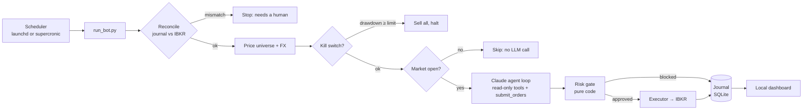

# guardrail-trader

An autonomous stock-trading agent for **Interactive Brokers (IBKR)**, built as a learning project in
**agent harness design**. Claude reviews the portfolio and proposes trades; plain, unit-tested code
decides whether any of them may reach the broker.

!!! abstract "Claude proposes, code decides"
    Every limit is enforced in code. Claude can read the limits, but it cannot change or bypass them.

!!! warning
    Runs against an IBKR **paper** (simulated) account by default. This is an engineering project,
    not investment advice. Automated trading can lose money.

## What it does

Twice per US trading day (shortly after the open and before the close), a scheduler starts one run:

## Two ways to run it

| | Native | Docker |
|---|---|---|
| IB Gateway | desktop app, logged in by you | container with IBC auto-login |
| Scheduler | launchd LaunchAgent | supercronic in the `bot` container |
| Dashboard | LaunchAgent | `dashboard` container |
| Keep the Mac awake | LaunchAgent | LaunchAgent (containers can't stop the Mac sleeping) |
| Guide | [Native setup](setup-native.md) | [Docker setup](setup-docker.md) |

Both modes share the same code, config and journal (`data/journal.sqlite`), so you can switch
between them without losing history. See [Architecture](architecture.md) for what runs where.

## Where to go next

- **[Harness and agent loop](harness-and-loop.md):** how Claude is wrapped, and why that matters more than the prompt.
- **[How to use](configuration.md):** set your own rules, ticker universe and spend caps.
- **[Dashboard](dashboard.md):** what each part of the dashboard shows.
- **[Operations](operations.md):** launchd as code, logs, the journal CLI and troubleshooting.
