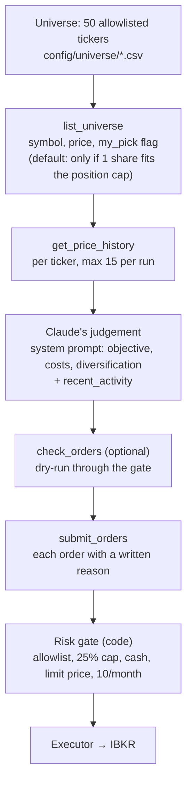
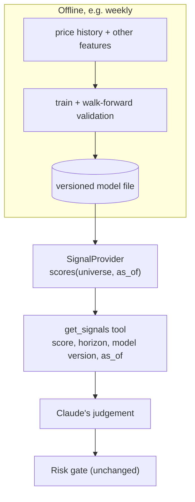

# How stocks are chosen

**Claude chooses. Code bounds the choice.** No code ranks the 50 stocks. The harness decides
*what Claude can see* and *what can go through*; inside those bounds the pick is Claude's judgement.

## What Claude sees

| Tool | Gives Claude | Limit | Code |
|---|---|---|---|
| `get_portfolio` | cash, holdings and weights, drawdown, orders used, max value per holding, `recent_activity` (last 10 orders and outcomes) | — | [`agent.py`](https://github.com/saifulislamamiyo/guardrail-trader/blob/main/guardrail_trader/agent.py) → `_portfolio()` |
| `list_universe` | symbol, currency, price (local and AUD), `my_pick` flag. **No company names or sectors.** | filters: affordable, my picks, symbols | → `_universe()` |
| `get_price_history` | 6-month summary: returns (1w/1m/3m/6m), SMA20/50, 6m high/low, drawdown from high, annualised volatility, last 10 closes | 15 calls per run | [`market.py`](https://github.com/saifulislamamiyo/guardrail-trader/blob/main/guardrail_trader/market.py) → `summarize_history()` |
| `check_orders` | the gate's verdict and reasons for proposed orders | 5 calls per run | → `_check()` |

What it does **not** see: news (web search is off by default), fundamentals, earnings, analyst
views, or any model score.

## What guides the judgement

The system prompt ([`agent.py`](https://github.com/saifulislamamiyo/guardrail-trader/blob/main/guardrail_trader/agent.py) → `SYSTEM_PROMPT`) sets the objective and trade-offs, not a formula:

- maximise long-term total return in AUD within the limits; holding is a valid decision
- each US order costs about US$1, so prefer fewer, deliberate trades
- diversify, because a concentrated portfolio can hit the kill switch
- prices may be ~15 minutes delayed
- `my_pick` stocks are candidates, not obligations
- don't blindly repeat orders that were just blocked or didn't fill

## A real example (paper account, first day)

From the journal and the run transcripts:

| Run | Stocks it looked at in detail | Bought | Claude's stated reasoning (abridged) |
|---|---|---|---|
| Open | NVDA, GOOGL, JNJ, MA, AMZN | all five | one per sector (semis, internet, healthcare, payments, consumer/cloud); positive 6-month momentum; JNJ as a lower-volatility anchor |
| Close | CSCO, FTNT, NFLX | CSCO | put idle cash (~8%) to work in a sixth holding; CSCO had lower volatility than FTNT |

In the open run Claude fetched history **only for the five it bought**: it shortlisted from the
ticker list using its own knowledge of the companies, then used the data to confirm. It did not
compare all 50 on data. The close run did compare three candidates.

!!! warning "What this is and isn't"
    - A language model's judgement on a small amount of price data, not a tested strategy.
    - Non-deterministic: the same inputs can produce different picks.
    - Breadth is bounded by the 15 history calls per run.
    - The paper-trading phase is how we find out whether the choices are any good.

## Extension point: signal providers (planned, not built)

Selection is modular: Claude only ever sees **tool results**, and the gate never depends on how a
proposal was reached. A new source of evidence, such as an ML model, plugs in as another read-only
tool, with no change to the gate, executor or journal.

Contract for any signal provider:

| Rule | Why |
|---|---|
| Read-only; returns scores, never orders | the gate stays the only path to the broker |
| Every score carries its model version and as-of time, and is logged in the journal | audit and later evaluation ("did high scores outperform?") |
| Fails closed: missing, stale or invalid output → a tool error | Claude falls back to today's behaviour |
| Shadow mode first: scores are logged but not shown to Claude | measure out-of-sample value before letting it influence trades |
| Covered by scenario evals (outage, stale model, drift) | same bar as the rest of the harness |

Where it would plug in: a provider passed into `run_once()` like the market data
([`pipeline.py`](https://github.com/saifulislamamiyo/guardrail-trader/blob/main/guardrail_trader/pipeline.py)),
exposed as a tool in [`agent.py`](https://github.com/saifulislamamiyo/guardrail-trader/blob/main/guardrail_trader/agent.py)
(`TOOLS`, `_dispatch()`), and simulated in [`evals/sim.py`](https://github.com/saifulislamamiyo/guardrail-trader/blob/main/evals/sim.py).
